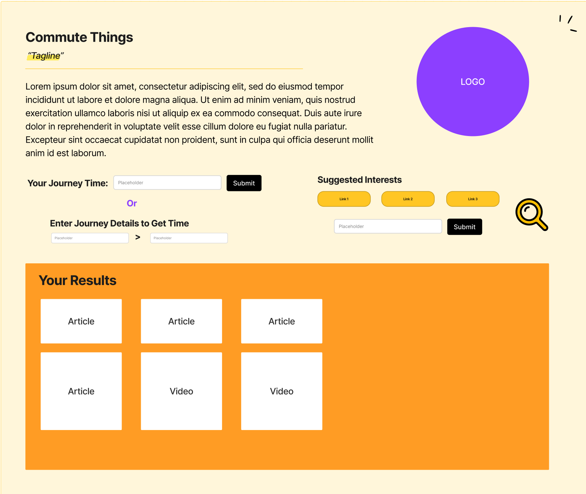

# 1 - Project Title:  
## Commute Things

# 2 - Team Members:
## Jamell Samuels Thomas Scott Jamil Tinbu 

# 3 A Brief Description: 
## a. Who is your audience? 

### The intended audience for this project are those who commute to work and want to find media to entertain. 

### The problem addressed by the product is that often workers find themselves bored while commuting to work. 

### The product solves the problem by providing media for the user to entertain themselves with during the journey.

# 4 MockUp - Wireframe: 

# 5 Rough Task List: 

1. Complete the HTML Scaffold.

2. Test API Endpoints 

3. Retrieve api responses from city mapper.

3. Retrieve and Parse data from a news aggregator.

5. Style using bootstrap for various viewports

6. Include local storage to save news data 

